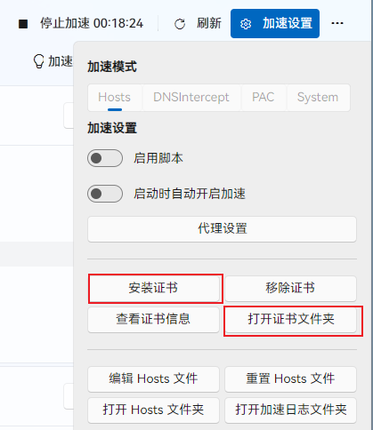

## 背景：被校园网“劝退”的 GitHub 之旅

作为一名开发者，长期以来受限于校园网的网络环境，我在访问 GitHub 时常常遇到连接超时、克隆失败等问题。为了规避这些麻烦，我不得不将许多项目托管在 Gitee（码云）上。虽然 Gitee 在国内速度飞快，但失去了 GitHub 庞大的开源生态和国际交流机会，始终是一种遗憾。

最近，我尝试重新将工作流迁移回 GitHub，却在第一步就遭遇了“滑铁卢”。本文将详细记录我如何排查问题，并从 **SSH 协议** 成功切换到 **HTTPS 协议**，并通过**配置 Git 信任 Watt Toolkit (原 Steam++) 的本地证书**，实现了既安全又丝滑的 `git push` 体验。

## 遇到的问题

### 1. SSH 协议直接被拒
起初，我习惯性地使用 SSH 协议进行克隆操作：

```bash
git clone git@github.com:desyang-hub/desyang.github.io.git
```

结果终端直接报错：
```text
Cloning into 'desyang.github.io'...
ssh: connect to host github.com port 22: Connection refused
fatal: Could not read from remote repository.
```
**分析**：这表明校园网防火墙直接封锁了 GitHub 的 **22 端口**（SSH 默认端口），或者 DNS 解析被干扰。即使安装了加速工具，若未正确配置 SSH 代理，流量依然无法穿透。

### 2. 切换 HTTPS 后的 SSL 证书报错
为了解决端口封锁问题，我改用 HTTPS 协议，并开启了 **Watt Toolkit** 的 GitHub 加速功能：

```bash
git clone https://github.com/desyang-hub/desyang.github.io.git
```

然而，新的错误出现了：
```text
fatal: unable to access 'https://github.com/...': 
SSL certificate problem: unable to get local issuer certificate
```
**分析**：这是典型的人中间代理（MITM）证书信任问题。Watt Toolkit 为了实现加速，会在本地拦截 HTTPS 流量并重新签发证书。Git 默认出于安全考虑，不信任这个由软件生成的本地根证书，因此拒绝连接。

## 解决方案：HTTPS + 信任本地证书 (推荐)

很多教程会建议直接关闭 Git 的 SSL 验证 (`http.sslVerify false`)，但这会降低安全性。**更规范的做法是将 Watt Toolkit 的根证书添加到 Git 的信任列表中**。

### 第一步：获取 Watt Toolkit 的根证书

1.  **打开 Watt Toolkit**，进入 **设置 (Settings)** 页面。
2.  找到 **加速 (Acceleration)** 或 **网络 (Network)** 相关选项卡。
3.  寻找 **“证书管理”**、**“重置证书”** 或 **“导出证书”** 按钮。
    *   如果找不到，可以尝试点击“重置证书”，软件通常会重新生成并提示保存路径。
    *   或者直接在文件资源管理器中查找，默认路径通常在：
        `C:\Users\你的用户名\AppData\Local\WattToolkit\`
        或
        `C:\Program Files\Watt Toolkit\`
    *   寻找后缀为 `.crt` 或 `.cer` 的文件，文件名通常包含 `CA` 或 `Certificate` (例如 `WattToolkit_CA.crt`)。
    
4.  **建议**：将该证书文件复制到一个好记的位置，例如桌面，并重命名为 `WattToolkit_CA.crt`。

### 第二步：配置 Git 信任该证书

打开命令行（CMD 或 PowerShell），执行以下命令，将证书路径告知 Git：

```bash
git config --global http.sslCAInfo "C:\Users\Lenovo\Desktop\WattToolkit_CA.crt"
```

*注意：请将引号内的路径替换为你实际的证书文件路径。如果路径中包含空格，必须保留英文双引号。*

此命令会告诉 Git：“除了系统默认的受信任证书外，额外信任这个由 Watt Toolkit 签发的证书。”

### 第三步：验证配置

执行以下命令确认配置已生效：

```bash
git config --global --get http.sslCAInfo
```

如果输出了你刚才设置的证书路径，说明配置成功。此时，Git 的 `http.sslVerify` 保持默认的 `true` 即可，无需修改。

### 第四步：切换远程仓库地址 (如果之前用的是 SSH)

如果你已经克隆了仓库（或者想修改旧项目的远程地址），需要将远程 URL 从 `git@...` 改为 `https://...`。

进入项目目录：
```bash
cd desyang.github.io
```

执行修改命令：
```bash
git remote set-url origin https://github.com/desyang-hub/desyang.github.io.git
```

验证地址：
```bash
git remote -v
# 应显示：origin  https://github.com/desyang-hub/desyang.github.io.git (fetch)
```

### 第五步：测试 Push 与身份验证

现在，尝试推送代码：
```bash
git push
```

此时 Git 会提示输入用户名和密码：
- **Username**: 你的 GitHub 用户名。
- **Password**: **必须是 Personal Access Token (PAT)**，不能是登录密码。
  - 生成方法：GitHub 网页 -> Settings -> Developer settings -> Personal access tokens -> Generate new token (classic)。
  - 勾选 `repo` 权限，生成后复制那串以 `ghp_` 开头的字符作为密码粘贴进去。

## 最终效果

完成上述配置后，Git 能够正确识别 Watt Toolkit 的代理证书，不再报 SSL 错误，同时享受到了加速带来的高速连接。

```text
Enumerating objects: 5, done.
Counting objects: 100% (5/5), done.
Delta compression using up to 8 threads
Compressing objects: 100% (3/3), done.
Writing objects: 100% (3/3), 320 bytes | 320.00 KiB/s, done.
Total 3 (delta 1), reused 0 (delta 0), pack-reused 0
remote: Resolving deltas: 100% (1/1), completed with 1 local object.
To https://github.com/desyang-hub/desyang.github.io.git
   8a2b3c4..d5e6f7g  main -> main
```

## 总结与反思

这次经历让我深刻体会到，面对网络限制，**“绕过”不如“适配”**。

1.  **SSH 并非万能**：在端口受限的网络（如校园网），SSH (Port 22) 往往是被优先封锁的对象。
2.  **HTTPS + 本地代理是王道**：443 端口通常用于 HTTPS 网页浏览，极少被封锁。配合 Watt Toolkit 等本地代理工具，能完美解决访问问题。
3.  **安全第一**：遇到 `SSL certificate problem` 时，不要习惯性直接关闭验证 (`sslVerify false`)。**导入代理软件的根证书**才是既解决问题又保障安全的最佳实践。这不仅适用于 Git，也适用于其他需要代理的开发工具（如 npm, pip 等，配置方式类似）。

希望这篇博客能帮助同样受困于校园网的小伙伴们，用更安全、更规范的方式回归 GitHub 的广阔世界！

---
**参考链接**：
- [Watt Toolkit 官网](https://steampp.net/)
- [Git 官方关于 SSL 配置的文档](https://git-scm.com/docs/git-config#Documentation/git-config.txt-httpsslCAInfo)
- [GitHub 官方关于 HTTPS 认证的说明](https://docs.github.com/en/authentication/keeping-your-account-and-data-secure/about-authentication-to-github)