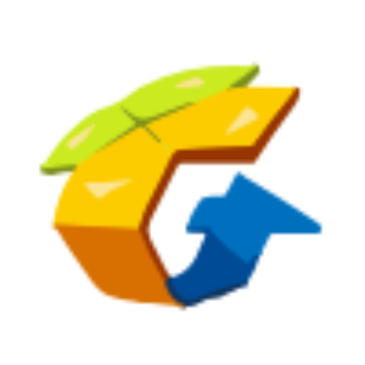

---
# the default layout is 'page'
icon: fas fa-user-circle
order: 4
description: 探索我的技术旅程、技能栈与联系方式
title: 关于我
---

<!-- 头部简介区域 -->

  
  <h1>👋 你好，我是 desyang</h1>
  
🚀 <strong>全栈开发者 | 开源爱好者 | 终身学习者</strong>

  
致力于用代码改变世界

<!-- 技能栈区域 -->
## 🛠️ 技术武器库

我热衷于探索新技术，以下是我目前主要使用的工具和技术：

| 领域 | 技能栈 |
| :--- | :--- |
| **💻 编程语言** |    |
| **⚙️ 后端/架构** |    |

<!-- 经历时间轴区域 -->
## 📜 成长轨迹

### 🎓 教育背景
- **计算机科学与技术 硕士**  
  📅 `2024` - `至今`
  > *主修课程：数据结构、操作系统、计算机网络、数据库、C++ 高级编程...*

<!-- 联系方式区域 -->
## 📬 联系我

无论是技术交流、项目合作还是单纯想交个朋友，都欢迎随时联系我！

  
  

